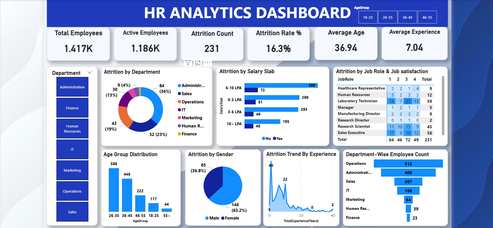

# 📊 HR Analytics Dashboard

A visually rich and insight-driven **HR Analytics Dashboard** designed to help organizations monitor employee data, analyze attrition trends, and make data-driven HR decisions.

---

## 🚀 Overview

This dashboard provides a comprehensive view of workforce analytics, including:

- Employee distribution  
- Attrition analysis  
- Salary insights  
- Experience trends  
- Department-wise breakdown  

It transforms raw HR data into actionable insights using interactive visuals.

---

## 🎯 Key Features

### ✨ Executive Summary Cards
- Total Employees: 1.417K
- Active Employees: 1.186K
- Attrition Count: 231
- Attrition Rate: 16.3%
- Average Age: 36.94
- Average Experience: 7.04 years

---

## 📊 Interactive Visualizations

### 🔹 Attrition Analysis
- Attrition by Department  
- Attrition by Salary Slab  
- Attrition by Job Role & Satisfaction  

### 🔹 Workforce Demographics
- Age Group Distribution  
- Gender-based Attrition  

### 🔹 Trends & Patterns
- Attrition Trend by Experience  
- Department-wise Employee Count  

---

## 🧠 Insights You Can Derive

- Identify departments with high attrition  
- Understand impact of salary on employee turnover  
- Analyze experience level vs attrition trends  
- Explore workforce age distribution  
- Compare gender-based attrition patterns  

---

## 🛠️ Tools & Technologies

- Power BI  
- Microsoft Excel  
- DAX  
- Power Query  

---

## 📷 Dashboard Preview

---

## ⚙️ How to Use

1. Download the project files  
2. Open in Power BI or Excel  
3. Use filters (Age Group, Department, etc.)  
4. Explore insights interactively  

---

## 📌 Use Cases

- HR Analytics  
- Employee Retention Strategy  
- Workforce Planning  
- Business Intelligence Projects  
- Portfolio Showcase  

---

## 💡 Future Improvements

- Predictive attrition modeling  
- Real-time data integration  
- Advanced drill-through insights  
- Employee performance analytics  

---

## 🤝 Contributing

Contributions are welcome!

- Fork the repository  
- Create a new branch  
- Submit a pull request  

---

## ⭐ Support

If you found this project useful, please give it a star on GitHub!
